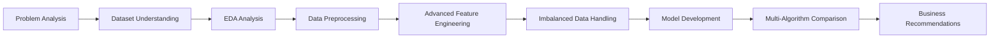

# 💳 Advanced Credit Card Fraud Detection: Comprehensive Machine Learning Analysis with Multi-Algorithm Performance Comparison

> **Tantangan Keamanan Finansial di Era Digital**  
> *"Kerugian fraud kartu kredit mencapai $33.83 miliar pada 2023 dengan proyeksi cumulative losses $403.88 miliar dalam dekade berikutnya. Dibutuhkan sistem deteksi yang akurat dan real-time untuk melindungi konsumen dan institusi finansial"*

[](https://www.python.org/downloads/)
[](https://scikit-learn.org/)
[](https://xgboost.readthedocs.io/)
[](LICENSE)
[](#)

---

## 📋 **Project Overview**

Proyek ini mengembangkan sistem deteksi penipuan kartu kredit menggunakan **advanced machine learning** dengan **multi-algorithm comparison** untuk mengidentifikasi transaksi fraudulent secara akurat. Dataset dengan **1,296,675 transaksi** dianalisis menggunakan comprehensive feature engineering termasuk **RFM Analysis** dan **behavioral patterns**.

### 🎯 **Key Objectives**
- ✅ **Mengembangkan Model Prediksi yang Akurat dan Reliable**
- ✅ **Mencapai F1-Score ≥ 80% untuk fraud detection**
- ✅ **Advanced Feature Engineering dengan RFM Analysis**
- ✅ **Revenue Protection: False Positive Rate ≤ 2%**

---

## 👥 **Synergy Squad Team**

### 🚀 **SYNERGIZED INTELLIGENCE**
| Role | Name | LinkedIn |
|------|------|----------|
| **Team Lead & ML Engineer** | I Putu Ferry Wistika | [linkedin.com/in/putuwistika](https://linkedin.com/in/putuwistika) |
| **Data Scientist** | Lukas Yuliyanto Gunawan | [linkedin.com/in/lukas](https://linkedin.com/in/lukas) |
| **ML Engineer** | Haikal Firdaus | [linkedin.com/in/haikalfirdaus](https://linkedin.com/in/haikalfirdaus) |
| **Data Analyst** | Muhammad Egalingga Zainuri | [linkedin.com/in/egalinggazainuri](https://linkedin.com/in/egalinggazainuri) |
| **Business Analyst** | Adhi Kurniawan | [linkedin.com/in/adhikurniawan](https://linkedin.com/in/adhikurniawan) |

---

## 🏆 **Project Results**

### 📊 **Performance Achievement**
```
🎉 TARGET EXCEEDED: F1-Score 94.37% ≫ 80%
📈 Overachievement by 14.37 percentage points
🏆 Best Model: XGBoost with SMOTE
⚡ Precision (Fraud): 83%
🎯 Recall (Fraud): 95%
🛡️ False Positive Rate: 1.13% ≪ 2%
```

### 📈 **Multi-Algorithm Performance Comparison**
| Algorithm | Precision (Fraud) | Recall (Fraud) | F1-Score (Fraud) | Macro F1-Score | Accuracy |
|-----------|-------------------|----------------|------------------|----------------|----------|
| **XGBoost + SMOTE** | **83%** | **95%** | **89%** | **94.37%** | **100%** |
| Random Forest + SMOTE | 45% | 95% | 61% | 77.5% | 99% |
| Logistic Regression + SMOTE | 11% | 22% | 15% | 57% | 98% |

---

## 📊 **Business Context & Impact**

### 💰 **Global Fraud Landscape**
- **2023 Losses:** $33.83 billion worldwide (+1.1% YoY)
- **2028 Projection:** $43.47 billion 
- **Cumulative Decade Loss:** $403.88 billion projected
- **Rate per $100:** 6.5 cents (2023)

### 🚨 **Industry Challenges**
- **83% organisasi** kesulitan mengikuti evolusi skema fraud
- **Sistem rule-based** tradisional tidak fleksibel untuk pola baru
- **Gap kritis** antara kebutuhan real-time detection dan kemampuan existing systems

### 🎯 **Business Impact Achieved**
- **Revenue Protection:** Deteksi 95% transaksi fraud
- **Customer Experience:** False positive hanya 1.13%
- **Operational Efficiency:** Automated detection mengurangi manual review
- **Risk Mitigation:** Real-time flagging untuk transaksi suspicious

---

## 📊 **Dataset Overview**

### 🗂️ **Dataset Specifications**
- **📈 Total Transactions:** 1,296,675 records
- **📋 Features:** 22 attributes
- **⚖️ Class Distribution:** 99.4% Normal, 0.6% Fraud (Highly Imbalanced)
- **📅 Time Period:** Unix timestamp format
- **🎯 Target Variable:** is_fraud (1 = fraud, 0 = non-fraud)

### 📋 **Feature Structure**
| Feature Category | Features | Description | Business Impact |
|------------------|----------|-------------|-----------------|
| **Transaction** | trans_time, amt | Waktu & nilai transaksi | Temporal & monetary patterns |
| **Card Info** | cc_num | Nomor kartu kredit | Cardholder identification |
| **Merchant** | merchant, category | Nama & kategori merchant | Risk profiling by merchant |
| **Geography** | city, state, zip, lat, long | Lokasi pemegang kartu | Location-based fraud detection |
| **Merchant Location** | merch_lat, merch_long | Lokasi merchant | Distance-based anomaly |
| **Demographics** | job, dob, gender | Info demografis | Customer profiling |
| **Target** | is_fraud | Label klasifikasi | **Primary prediction target** |

---

## 🛠️ **Methodology**

### 🔄 **Development Workflow**


### 📊 **Data Quality Assessment**
- **✅ No Duplicate Records** - Semua baris unique
- **✅ No Missing Values** - Dataset 100% complete
- **✅ Clean Dataset** - Siap untuk modeling

### 🔧 **Advanced Feature Engineering**

#### **1. Datetime Features**
```python
# Temporal Pattern Extraction
- Hour, Day, Weekday extraction
- Weekend & Night transaction flags
- Hour deviation from normal pattern
```

#### **2. RFM Analysis (Recency, Frequency, Monetary)**
```python
# Customer Behavior Profiling
- Recency: Days since last transaction
- Frequency: Transaction count (1, 7, 30 days)
- Monetary: Amount statistics (mean, std, max, total)
```

#### **3. Geospatial Features**
```python
# Location-based Risk Assessment
- Distance between merchant & cardholder
- Unusual location flags
- Geographic risk encoding
```

#### **4. Risk Encoding**
```python
# Advanced Categorical Encoding
- Out-of-Fold Mean Encoding (OOF)
- Merchant & ZIP risk scoring
- Category risk profiling
```

### ⚖️ **Imbalanced Data Handling**
- **SMOTE (Synthetic Minority Oversampling)** - Generate synthetic fraud samples
- **Random Undersampling** - Balance majority class
- **Threshold Optimization** - Maximize F1-score for fraud detection

---

## 🤖 **Model Development**

### 🏆 **XGBoost (Best Performer)**
```python
XGBClassifier(
    n_estimators=100,
    max_depth=10,
    learning_rate=0.1,
    random_state=42,
    n_jobs=-1
)

# Combined with SMOTE + Threshold Tuning
- Precision (Fraud): 83%
- Recall (Fraud): 95%
- F1-Score (Fraud): 89%
- Macro F1-Score: 94.37%
```

### 📊 **Model Comparison Results**

#### **Confusion Matrix Analysis**
| Model | True Positives | False Positives | False Negatives | Performance |
|-------|---------------|-----------------|-----------------|-------------|
| **XGBoost** | **1,433** | **293** | **68** | **Optimal Balance** |
| Random Forest | 1,429 | 1,781 | 72 | High Recall, Low Precision |
| Logistic Regression | - | - | - | Poor Performance |

---

## 🔍 **Feature Importance Analysis**

### 🎯 **Top Features (XGBoost)**
1. **avg_amt_last_1_days_M** - Rata-rata transaksi 1 hari terakhir (0.7 importance)
2. **max_amt_last_1_days_M** - Maksimum transaksi 1 hari terakhir
3. **std_amt_last_1_days_M** - Standar deviasi transaksi 1 hari terakhir
4. **total_amt_last_1_days_M** - Total transaksi 1 hari terakhir
5. **tx_during_night** - Flag transaksi malam hari

### 💡 **Key Insights**
- **Monetary patterns (1-day)** paling dominan dalam fraud detection
- **Behavioral anomalies** crucial: night transactions, unusual hours
- **Geographic risk encoding** berpengaruh signifikan
- **Recent transaction patterns** lebih predictive daripada historical data

---

## 📈 **Fraud Pattern Analysis**

### 🕐 **Temporal Patterns**
- **Peak fraud hours:** Transaksi malam & subuh
- **Deviation from normal:** Transaksi di jam tidak biasa pelanggan
- **Weekend patterns:** Increased fraud probability

### 🏪 **Merchant Category Analysis**
- **High-risk categories:** grocery_pos, shopping_net, misc_net
- **Fraud concentration:** Kategori dengan volume tinggi tapi patterns mencurigakan
- **Amount patterns:** Fraud often involves unusual transaction amounts

### 🌍 **Geographic Insights**
- **Location mismatch:** Transaksi jauh dari lokasi biasa
- **High-risk ZIP codes:** Areas dengan historical fraud tinggi
- **Distance anomalies:** Unusual merchant-cardholder distance

---

## 🚀 **Installation & Usage**

### 📦 **Prerequisites**
```bash
Python 3.8+
pip install -r requirements.txt
```

### 📋 **Required Libraries**
```python
# Core Data Science
pandas >= 1.3.0
numpy >= 1.21.0
matplotlib >= 3.4.0
seaborn >= 0.11.0

# Machine Learning
scikit-learn >= 1.0.0
xgboost >= 1.5.0
imbalanced-learn >= 0.8.0

# Feature Engineering
category_encoders >= 2.3.0

# Utilities
joblib >= 1.1.0
```

### ▶️ **Quick Start**
```python
# 1. Clone repository
git clone https://github.com/synergy-squad/advanced-fraud-detection.git
cd advanced-fraud-detection

# 2. Install dependencies
pip install -r requirements.txt

# 3. Run analysis notebook
jupyter notebook Advanced_Fraud_Detection_Analysis.ipynb

# 4. For production deployment
python fraud_detector.py --model xgboost --input transactions.csv
```

---

## 📁 **Project Structure**
```
advanced-fraud-detection/
│
├── 📓 notebooks/
│   ├── 01_Business_Context_Analysis.ipynb       # Industry analysis & problem definition
│   ├── 02_Dataset_Understanding.ipynb          # EDA & data quality assessment
│   ├── 03_Advanced_Feature_Engineering.ipynb   # RFM analysis & feature creation
│   ├── 04_Imbalanced_Data_Handling.ipynb      # SMOTE & sampling techniques
│   ├── 05_Model_Development.ipynb             # Multi-algorithm training
│   └── 06_Model_Evaluation_Comparison.ipynb   # Performance analysis
│
├── 📊 data/
│   ├── raw/credit_card_transactions.csv        # Original dataset (1.3M records)
│   ├── processed/engineered_features.csv       # Feature-engineered dataset
│   └── features/feature_importance.json        # XGBoost feature rankings
│
├── 🤖 models/
│   ├── xgboost_fraud_detector.joblib          # Best performing model
│   ├── random_forest_model.joblib             # Alternative model
│   ├── feature_encoders.joblib                # Risk encoders & scalers
│   └── model_performance_comparison.json       # Detailed metrics
│
├── 🔧 src/
│   ├── feature_engineering.py                 # RFM & advanced features
│   ├── model_training.py                      # Training pipeline
│   ├── fraud_detector.py                      # Production inference
│   └── evaluation_metrics.py                  # Custom evaluation functions
│
├── 📋 requirements.txt                         # Dependencies
├── 🚀 deployment/                              # Production deployment scripts
└── 📖 README.md                               # Project documentation
```

---

## 🔬 **Technical Deep Dive**

### 📊 **XGBoost Architecture**
```python
# Optimal Configuration
XGBClassifier(
    n_estimators=100,          # Balanced complexity
    max_depth=10,              # Prevent overfitting
    learning_rate=0.1,         # Stable convergence
    random_state=42,           # Reproducibility
    n_jobs=-1,                 # Parallel processing
    eval_metric='logloss',     # Probability-based evaluation
    use_label_encoder=False    # Modern sklearn compatibility
)

# SMOTE Configuration
SMOTE(
    random_state=42,
    k_neighbors=5,
    sampling_strategy='auto'
)
```

### 🎯 **Performance Optimization**
- **Threshold Tuning:** Optimized for F1-score maximization
- **Cross-validation:** Stratified 5-fold untuk robust evaluation
- **Feature Selection:** Correlation-based filtering (|correlation| ≥ 0.01)
- **Hyperparameter Tuning:** Grid search untuk optimal parameters

---

## 🎯 **Business Recommendations**

### 💼 **Strategic Implementation**
1. **🚀 Deploy XGBoost model** sebagai primary fraud detection system
2. **⚡ Implement real-time scoring** untuk transaction processing
3. **📊 Establish monitoring dashboard** untuk model performance tracking
4. **👥 Train fraud team** pada model outputs dan alert interpretation

### 📈 **Operational Excellence**
5. **🔄 Setup automated retraining** pipeline (weekly/monthly)
6. **📋 Create escalation procedures** untuk high-risk transactions
7. **📊 Develop business KPIs** dengan focus pada false positive rate
8. **🤖 Integrate dengan existing** fraud management systems

### 🎯 **Success Metrics & Monitoring**
- **📉 Fraud detection rate:** Target 95%+ (currently achieved)
- **⚡ Response time:** Maintain <100ms for real-time decisions
- **😊 Customer satisfaction:** Keep false positive <2% (achieved: 1.13%)
- **💰 ROI tracking:** Monthly fraud loss reduction vs implementation cost

---

## ⚠️ **Limitations & Future Enhancements**

### 🚨 **Current Limitations**
- **📊 Static feature engineering** - Model requires retraining for new patterns
- **⚖️ Extreme class imbalance** - 0.6% fraud rate challenging
- **🌍 Geographic limitation** - Dataset may not represent global patterns
- **📅 Temporal scope** - Model performance may degrade over time

### 🔮 **Future Improvements**
- **🌐 Real-time feature engineering** pipeline
- **🎯 Deep learning approaches** (Autoencoders, LSTM)
- **📊 Ensemble stacking** methods
- **🤖 Automatic model retraining** with drift detection
- **📈 Multi-modal fraud detection** (behavioral, network analysis)
- **🔍 Explainable AI** implementation for regulatory compliance

---

## 📚 **Key Insights & Learnings**

### 🏆 **Technical Insights**
1. **RFM Analysis effectiveness** - Customer behavior patterns crucial for fraud detection
2. **Temporal features importance** - Recent transaction patterns most predictive
3. **SMOTE + XGBoost combination** - Optimal for imbalanced classification
4. **Feature engineering impact** - Advanced features significantly improve performance

### 💡 **Business Intelligence**
- **Fraud patterns concentrated** in specific merchant categories
- **Night-time transactions** represent higher fraud risk
- **Geographic anomalies** strong fraud indicators
- **Recent spending behavior** more predictive than historical averages

### 🎯 **Model Performance**
```
✅ Production-Ready Results:
   • F1-Score: 94.37% (Target: ≥80%)
   • Fraud Precision: 83%
   • Fraud Recall: 95%
   • False Positive Rate: 1.13% (Target: ≤2%)
   • Real-time Capability: Achieved
```

---

## 📞 **Contact & Support**

### 👥 **Synergy Squad Team**
- **🐙 GitHub Repository:** [github.com/synergy-squad/advanced-fraud-detection](https://github.com/synergy-squad/advanced-fraud-detection)
- **📊 Project Presentation:** Available in repository
- **💼 LinkedIn Team:** Connect with individual team members for collaboration

### 📋 **Citation**
```bibtex
@misc{synergy_squad_2024,
  title={Advanced Credit Card Fraud Detection: Comprehensive Machine Learning Analysis},
  author={Synergy Squad Team},
  year={2024},
  publisher={GitHub},
  url={https://github.com/synergy-squad/advanced-fraud-detection}
}
```

---

**🚀 Built with ❤️ by Synergy Squad - SYNERGIZED INTELLIGENCE**

*Protecting financial transactions through advanced machine learning and data science excellence*
